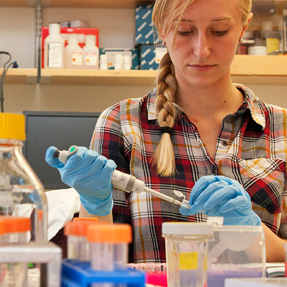
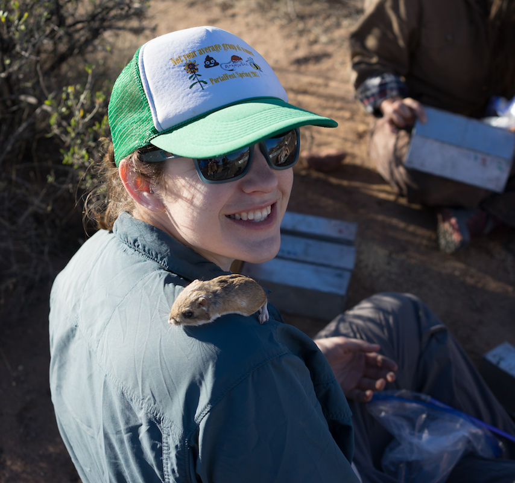
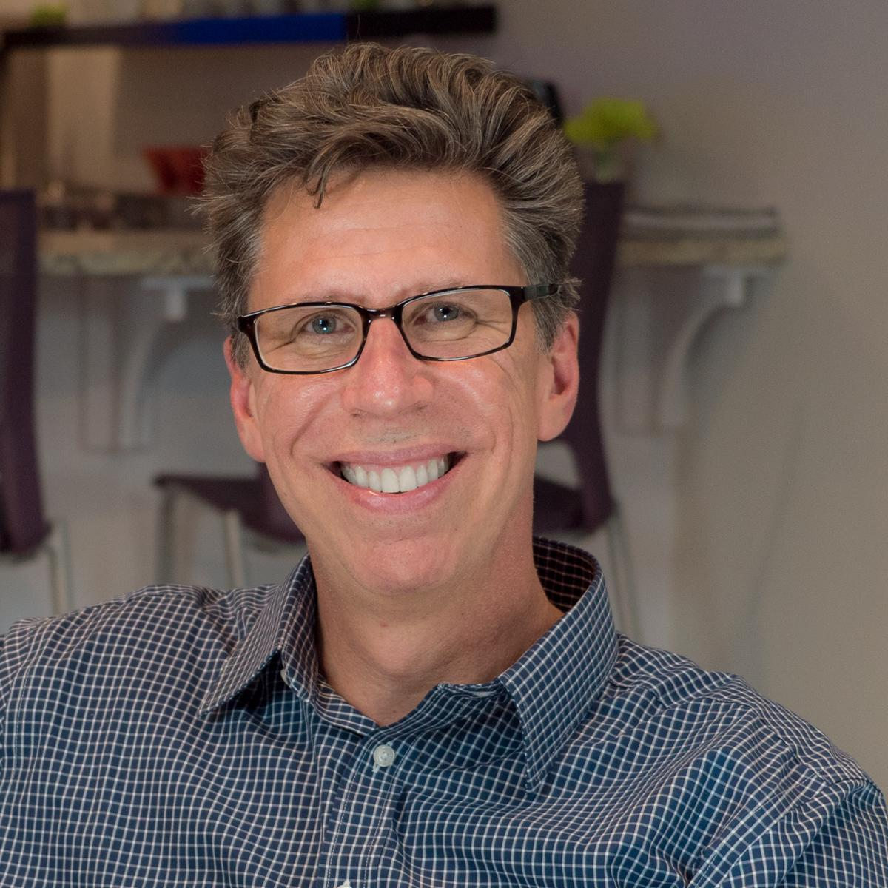

# Speakers

<table>

<tr>
<td></td>
<td>**Zannah Marsh** is Practice Lead, Learning Experiences at Mozilla, where she facilitates discovery, skill-building, collaboration across global communities. She has a master's degree from NYU's Interactive Telecommunications Program and a BFA in printmaking and drawing from Tufts University/The School of the Museum of Fine Arts.
</td>
</tr>

<tr>
<td></td>
<td>**Kelsey Lewis** is a PhD student in the University of Florida's Biology Department, studying the development of sex variation in mammals, and as a queer feminist biologist, the intersection of gender studies and biology. Kelsey is a National Science Foundation Graduate Research Fellow, an American Association of University Women fellow, and a 2019 recipient of the Madelyn Lockhart Dissertation Award from UF's Association for Academic Women. She is president of UF's Women in Science and Engineering organization, and also organizes a monthly feminist science reading group.</td>
</tr>

<tr>
<td></td>
<td>**Ellen Bledsoe** is a PhD student in Interdisciplinary Ecology in the University of Florida School of Natural Resources, studying long-term dynamics of desert rodents. Ellen is an inaugural EDSIN-QUBES Open Education Fellows, facilitating an online community for inclusive teaching of data science in undergraduate classrooms. She is president of the Natural Resources Diversity Initiative (NRDI), a student organization committed to increasing diversity in natural resource fields. She is co-founder of the UF Ally Skills Network and has organized multiple Ally Skills workshops.</td>
</tr>

<tr>
<td></td>
<td>**Ken Baldauf** is the Founding Director of Florida State University’s Innovation Hub, where students from all disciplines work together, utilizing Design Thinking with emerging technologies, to confront the demanding and complex problems of our day. With a background in music and computer science, Ken has turned his efforts towards fostering creativity and innovation across all ages.</td>
</tr>

</table>